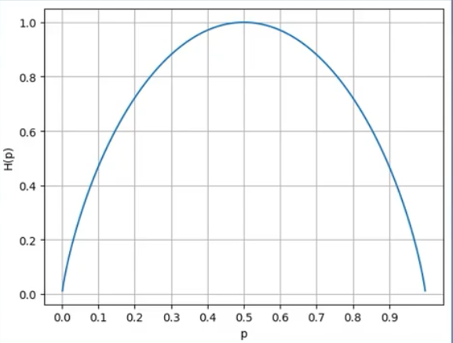
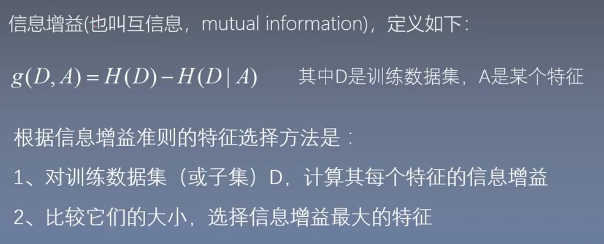
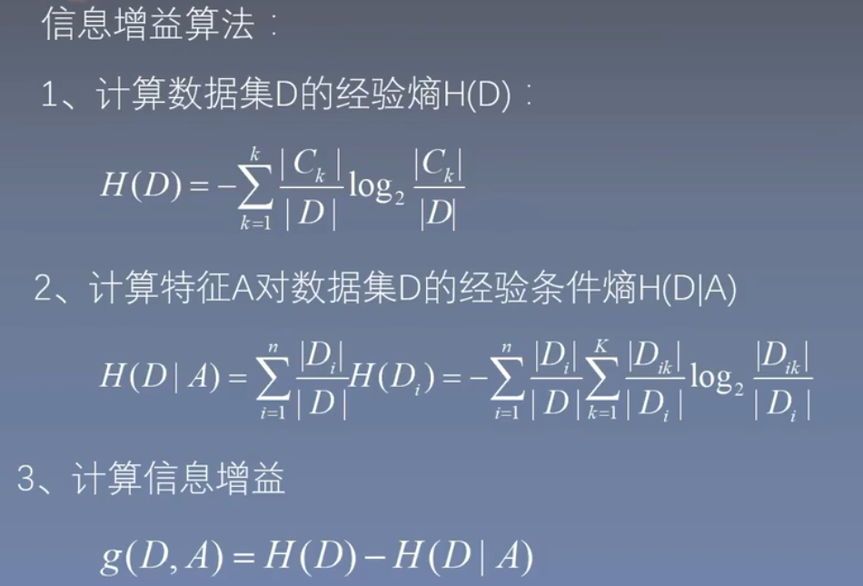
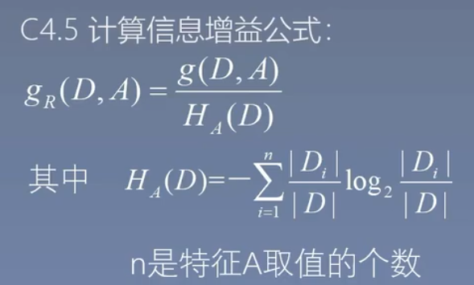
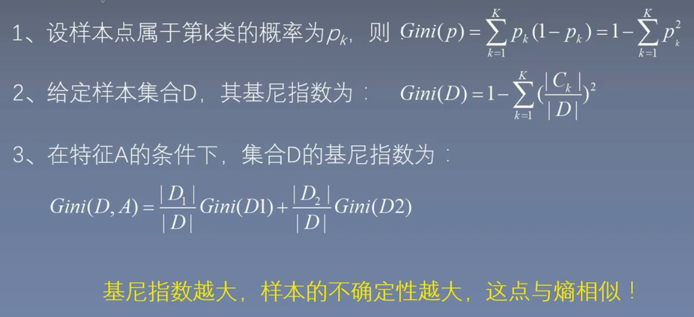
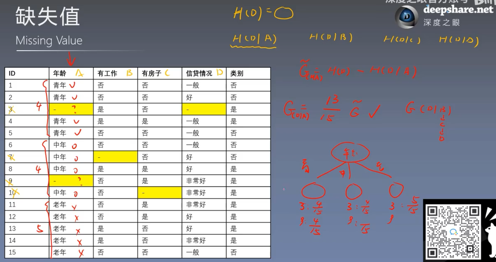

### 1. 问题

假设你要买一台电脑，你会根据多个特征来进行做出决策，比如：处理器、价格，购买能力、外观，科技程度、品牌程度。但事实上，电脑不可能同时兼容这些特征，那么我们优先选择哪个特征呢？这并不是我们人为选择的，而是根据的信息来确定的。

### 2. 熵

#### 2.1 熵：表示随机变量的不确定性。

​	定义如下：
$$
H_{p} = -\sum_{i=1}^{n} p_{i}\log_{}{p_{i}}
$$
​	当n=2时：图像如下：
$$
H_{p} = - p\log_{}{p} - (1-p)\log_{}{(1-p)}
$$

​	**熵越大，随机变量的不确定性越大。**比如，抛硬币，正负的概率都是0.5，熵值最大

#### 2.2 条件熵

​	**给定条件**下的信息熵，可以理解为：已知电脑性能强，该特征对于买电脑的确定性。定义如下：
$$
\begin{align}  
H(Y|X) = \sum_{i=1}^{n} p_{i}H(Y|X=x_{i} ) \\  
其中   p_{i}=P(X=x_{i} )
\end{align}
$$

### 3. 决策树的三种分类算法

​	**1：信息增益**

​	**2：信息增益比**

​	**3：gini指数**

#### 3.1 信息增益

#### 3.2. ID3算法构建决策树

**本质** 是在构建决策树时，使用信息增益的方法来进行特征选择

**until** 所有的特征信息增益很小（意味着很确定）或者没有特征选择

#### 3.3. C4.5算法

对ID3算法的改进，采用**信息增益比**来选择特征。

目的：在使用信息增益的时候，可能存在这样一种情况，它的特征类别特别的多。(极端情况下，特征类别数量等于样本数据)。这种情况下，在该特征的情况下，信息增益变得很大，但是其实这种情况下，泛化能力会变低。考虑到这种情况，还有一种修正的方法，那就是信息增益比。

#### 3.4 CART算法

在树的生成过程中，使用**基尼指数**来选择最优特征

**基尼指数：**

### 4.决策树的剪枝

#### 4.1 预剪枝

1. 每个结点在生成树的过程中，都会检测一下准确率。如果准确率有提升，则表示子树生成成功，否则还原。
2. 继续进入下个结点的生成树过程。

#### 4.2 后剪枝

1. 首先正常生决策成树
2. 找到最深的结点树，判断剪枝后的准确率是否有提升，如果有提升则继续剪枝。

### 5.决策树的数据处理：连续值与缺失值

#### **5.1 连续值**

可以按照从小到大的顺序将其分成两个片段

比如工资：5600，7600，8165，9800，12000，36000

第一次：是否大于5600，得到熵值D1

第二次：是否大于7600，得到熵值D2

...

依次下去，一定能找到**熵值最低**的片段分割决策

#### 5.2 缺失值

1. **如果数据量大，缺失值少**，最简单的方式就是直接删除，但显然不适应于所有场景
2. 

