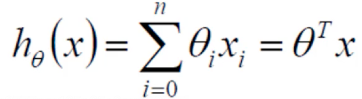

# 1.Linear_Regression
## 1.问题分析
    X1,X2...Xn是我们的n个特征，Y是最终的目标值=>找到一给函数尽可能的拟合数据点

## 2. 整合回归方程
    整合是把偏置项和权重参数项放到了一起（加了个θ0让其都等于1）
        假设θ0为偏置项，θ1和θ2是权重参数。
        拟合的平面：hθ(x) = θ0*1 + θ1*X1 + θ2*X2 。参数θ1、θ2为权重项，对结果影响较大。θ0是偏置项。
        整合为矩阵形式：

## 3.误差定义——函数的目标是使误差越小越好，这样结果就越准确
    真实值与预测值肯定要存在差异——用 ε 来表示该误差。
    对于每个样本：y(i) = θT*x(i) + ε(i) ，y(i)是真实值，θTx(i)是预测值， ε(i)是差异值。
    每一个样本的误差值是不同的：

## 4.误差规律——独立同分布
    独立同分布（iid，independently identically distribution）在概率统计理论中，指随机过程中，任何时刻的取值都为随机变量，如果这些随机变量服从同一分布，并且互相独立，那么这些随机变量是独立同分布。
    误差ε(i)是独立且具有相同分布，并且服从均值为0方差为θ2的高斯分布；
    独立：张三和李四一起来贷款，他俩没有关系，即每个样本到拟合平面的距离都不相同；
    同分布：他俩都来得是我们假定的同一家银行，不在同一银行就没有分析的意义了，所以它在预测的时候是按照同样的方式，数据是在同一个分布下去建模，尽可能来自相同的分布；
    高斯分布（正态分布）：银行可能会多给，也可能会少给，但是绝大多数情况下，这个浮动不会太大，极小情况下浮动会比较大（有的多有的少，大概来看，均值为0）。
    误差在0附近浮动的可能性较大，正负差距较大的可能性越来越小。符合概率统计中现实分布情况

## 5.误差的分析
    εi 来表示i个误差的矩阵形式，ε与x组合之后成为y(真实值)的可能性越大越好                                                                                                                                                                                     
    引入似然函数：连续型变量相互独立的充要条件是联合概率密度等于边缘概率密度的乘积。因此变量符合独立同分布前提下，联合概率密度等于边缘概率密度的乘积成立。
    取对数：log(AB) = logA + logB
    为什么取对数：因为我们要找的是θ
        取对数虽然会改变极值，但不会改变极值点。任务依然是求极值，因此L(θ)和logL(θ)两者是等价的。

## 6.误差优化

## 7.求解
    1.矩阵式直接求解：
        1.让J(θ)对θ求偏导，当偏导等于零时，则这个θ就是极值点。XT代表X矩阵的转置，XT与X的乘积一定会得到一个对称阵。
        2.缺点：
            矩阵求逆不是一个必然成功的行为（存在不可逆）；
            不存在学习的过程；

    2.梯度下降(GD)：梯度一定是函数上升的方向， 最小值为0
        1.分析：
            1.梯度下降时，θ0和θ1是互不干扰的，无关系，故可以分别优化而不是一起。
            2.怎么下山(参数更新)
                1.找到最合适的方向——切线方向
                2.步伐要适中，走快了该“跌倒了”，走慢了耗费时间
                3.步步更新参数

        2.是对θ矩阵中的θj求导，而不是θ，每一个误差都有θj，所有下面批量中含有求和
            为什么批量中最后是负号：梯度一定是函数上升的方向， 最小值为0，而现在考虑的是下降方向

## 8.预处理对结果的影响
    如果X1与X2的数据差距很大，一组为另一组的十及以上倍数时，比如年龄和薪资的倍数，薪资的浮动会比较大，在迭代的时候速度会很慢，所以一般拿到数据后先进行标准化，或者归一化

## 9.梯度下降的效果
    1.批量
    2.随机梯度下降
    3.小批量Mini Batch

## 9.不同梯度下降的对比
## 10.过拟合与欠拟合
## 11.正则化的作用
## 12.提前停止策略
## 13.非线性：多项式（次幂）而非多特征
    sklearn.preprocessing.polynomialfeatures

## 14.流水线操作：sklearn.pipeline（step）

