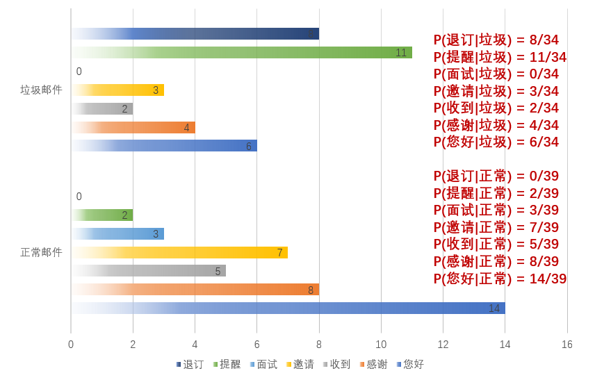

### 1.问题详情：

###### 假设小明收到了30封邮件，其中16封正常邮件，14封垃圾邮件，如果接下来收到一封邮件，怎么判断是否是垃圾邮件？

### 2.问题解析：

###### 小明想：我能不能按照消息中的关键词来对邮件分类。

### 3.具体操作：

###### 小明按照已知邮件得到分类概率：P(正常)=16/30，P(垃圾)=14/30，然后从两类中提取关键词并统计次数。

 

###### 假如现在收到一封邮件，包含关键词：退订、面试、提醒

$$
P(正常)*P(退订|正常)*P(提醒|正常)*P(面试|正常) = 16/30*0/39*2/39*3/39 = 0
$$

$$
P(垃圾)*P(退订|垃圾)*P(提醒|垃圾)*P(面试|垃圾) = 14/30*8/34*11/34*0/34 = 0
$$

###### 这里我们发现一个问题，由于某些关键词未出现导致概率为0，为了避免这种现状，我们采用*<u>**拉普拉斯平滑技巧**</u>*对所有关键词次数+1

$$
P(正常)*P(退订|正常)*P(提醒|正常)*P(面试|正常) = 16/30*1/46*3/46*4/46 = 0.000066
$$

$$
P(垃圾)*P(退订|垃圾)*P(提醒|垃圾)*P(面试|垃圾) = 14/30*9/41*12/41*1/41 = 0.00073
$$

### 4.朴素贝叶斯的朴素体现在：

1.特征之间**相互独立性假设**：

​	       1.意味着对关键词的顺序不敏感。比如：**红豆**生南国，我**喜欢**你/我**喜欢**吃**红豆**。

​		   2.同个关键词出现多次并不认为是一个关键词。比如：提醒、退订、面试、提醒。概率为：
$$
     P(正常)*P(退订|正常)*P(提醒|正常)^2*P(面试|正常) = 16/30*1/46*3/46*3/46*4/46 = 0.000043
$$
2.关键词未出现导致概率为0的现象。

### 5.公示总结：

给定数据集T：
$$
T = {(x_{1},y_{1}),(x_{2},y_{2}),...,(x_{n},y_{n})}
$$
x为样本特征，有一系列独立的特征构成：
$$
x_{i} = \left (x^{1} ,...,x^{n}\right)
$$
y是类别：
$$
y_{i} = c_{k},(其中k = 1, 2,...,K)
$$

根据**条件概率分布**和**全概率分布**可以得到等式：
$$
P(y=c_k|x)=\frac{P(y=c_k)P(x|y=c_k)}{\sum_kP(y=c_k)P(x|y=c_k)}
$$
因为分母上的值对于每个类别都是一样的，因此我们可以去掉分母类似于对每个类别都乘以了了一个相同的系数，得到一个正比关系：
$$
P(y=c_k|x)\propto P(y=c_k)P(x|y=c_k)
$$
因为我们认为x是相互独立的，因此可以拆分为一系列特征的累乘：
$$
P(y=c_k|x)\propto P(y=c_k)\prod_jP(x^j|y=c_k)
$$
最后，正确程度最高的概率类别为分类结果：
$$
y=argmax_{c_k}P(y=c_k)\prod_jP(x^j|y=c_k)
$$

### 6.例题分析：

假设A,B两个盒子球有无限个，已知从A盒子摸出红球和白球的概率为0.7和0.3，从B盒子中摸出的红球和白球的概率为0.5和0.5。从某一个盒子中摸了3次球，颜色依次为白，白，红。问是从A盒子中摸得概率是多少？此时我们得公式为：
$$
P(Y=A|X=白,X=白,X=红) = \frac{P((X=白,X=白,X=红)|Y=A)}{P(X=白,X=白,X=红)} * P(Y=A)
$$
可以理解：
$$
P(Y=A) = P(Y=B) = 0.5
$$
根据全概率分布和独立分布，分母可以得到：
$$
P(X=白,X=白,X=红)
$$

$$
= P((X=白,X=白,X=红)|Y=A) + P((X=白,X=白,X=红)|Y=B)
$$

$$
= P(X=白|Y=A) * P(X=白|Y=A) * P(X=红|Y=A) + P(X=白|Y=B) * P(X=白|Y=B) * P(X=红|Y=B)
$$

最终：
$$
P(Y=A|X=白,X=白,X=红) = \frac{0.3*0.3*0.7}{0.3*0.3*0.7*0.5+0.5^{4} } * 0.5 \approx 0.3351
$$
