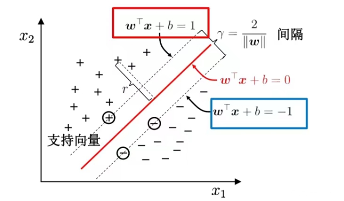
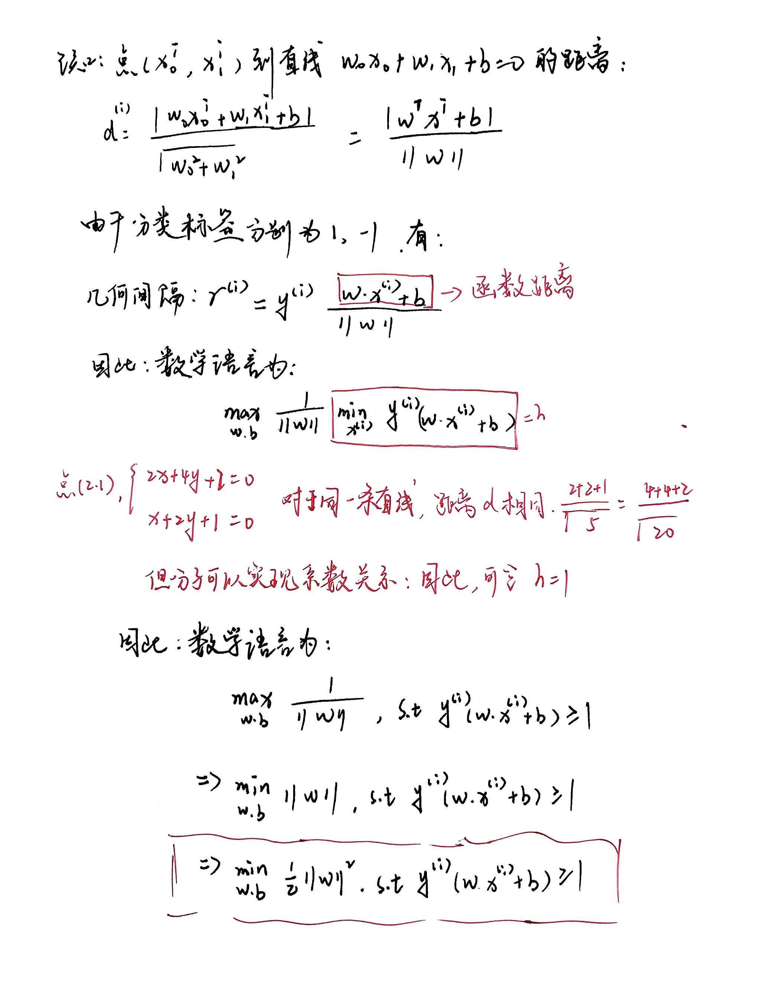
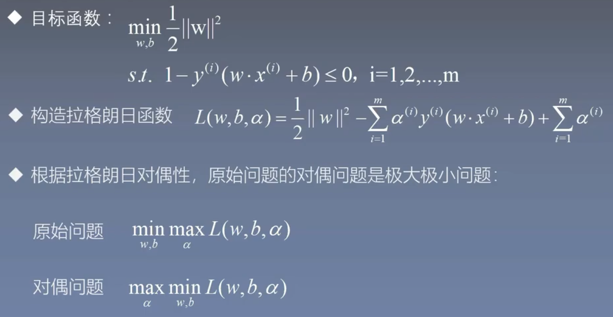
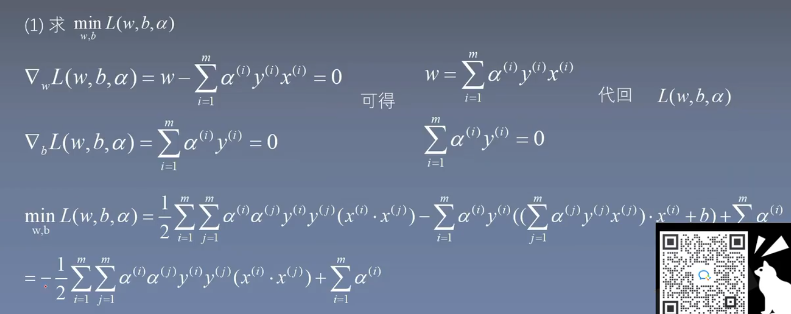
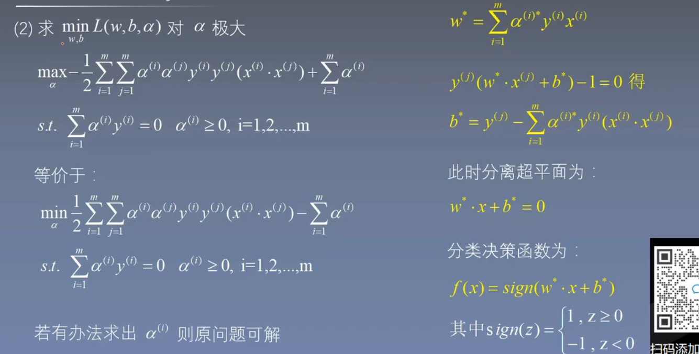
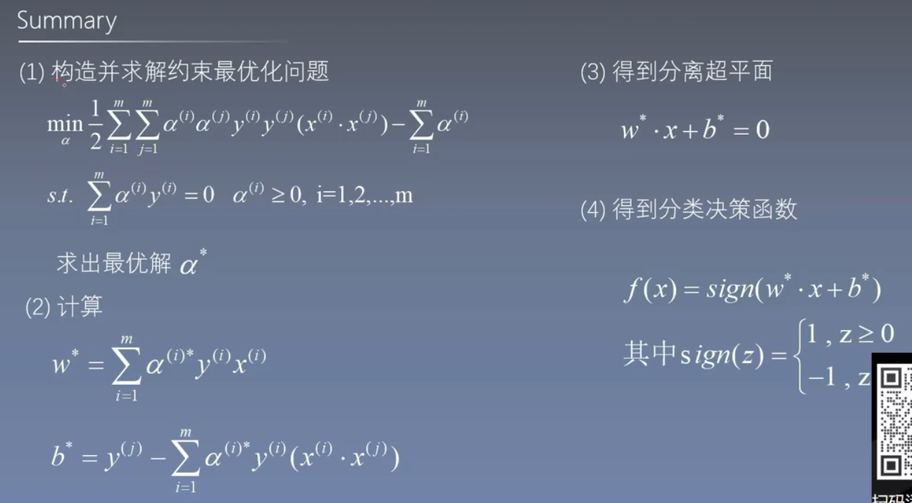

### 1. 基本概念：

1. 是一种分类模型，存在一个支持或者支撑平面将类别划分

2. 硬间隔与软间隔

3. 核技巧：学习非线性分类器（线性不可分的情况下）

### 2. SVM的原理：

找到一个超平面，这个超平面能够分离正负样本的同时，使得正样本和负样本到超平面的间隔是最大的。因此SVM又称为最大间隔分类器。

### 3. 最大间隔超平面

分割直线可能不止一条，为了保证鲁棒性，将会选择中间的一条直线。

### 4.目标函数优化

